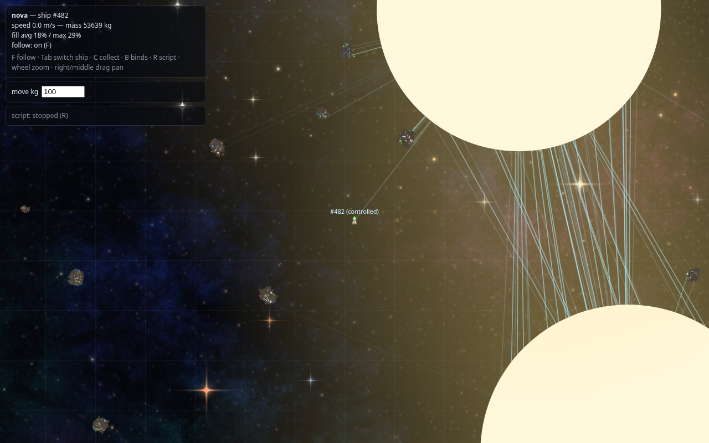
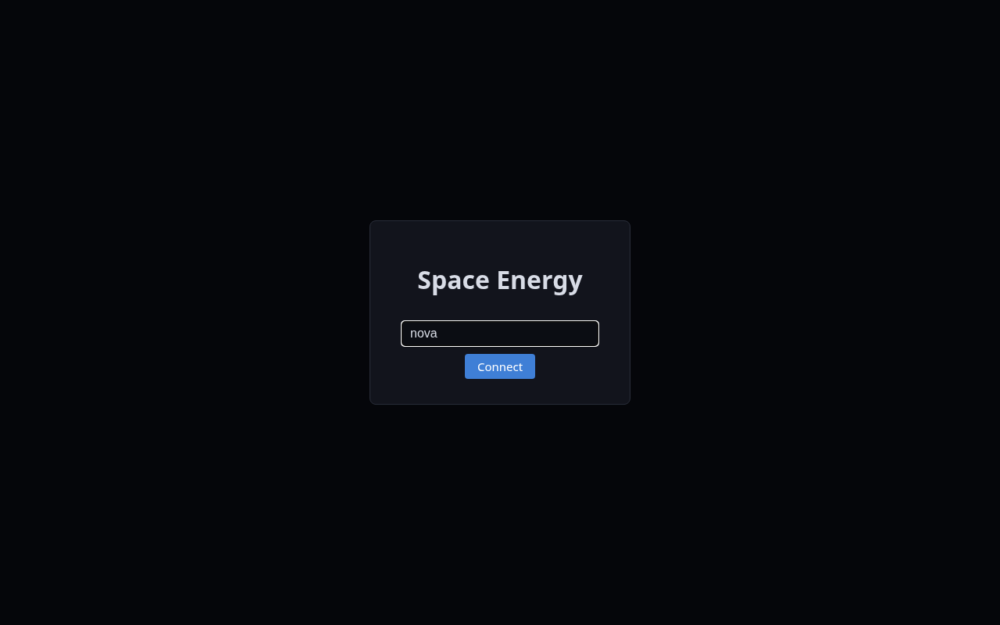
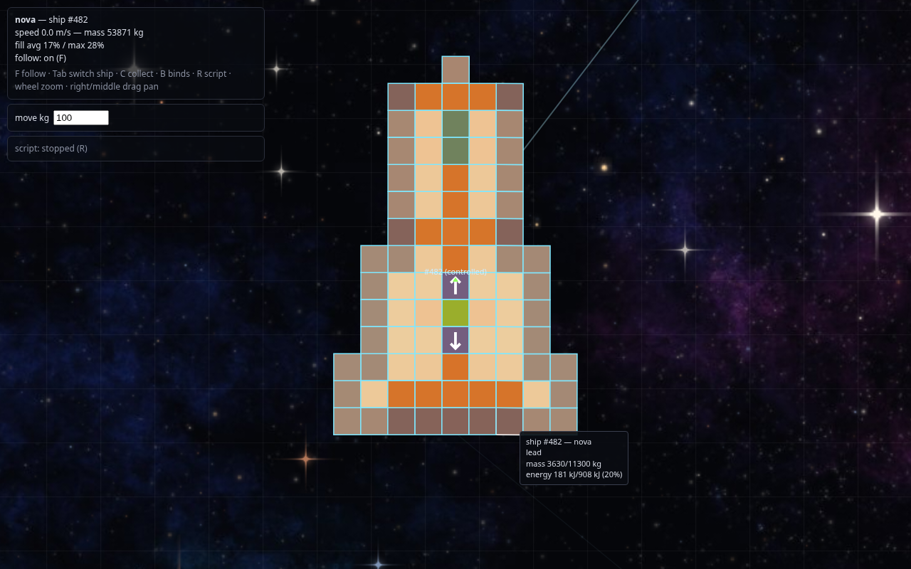
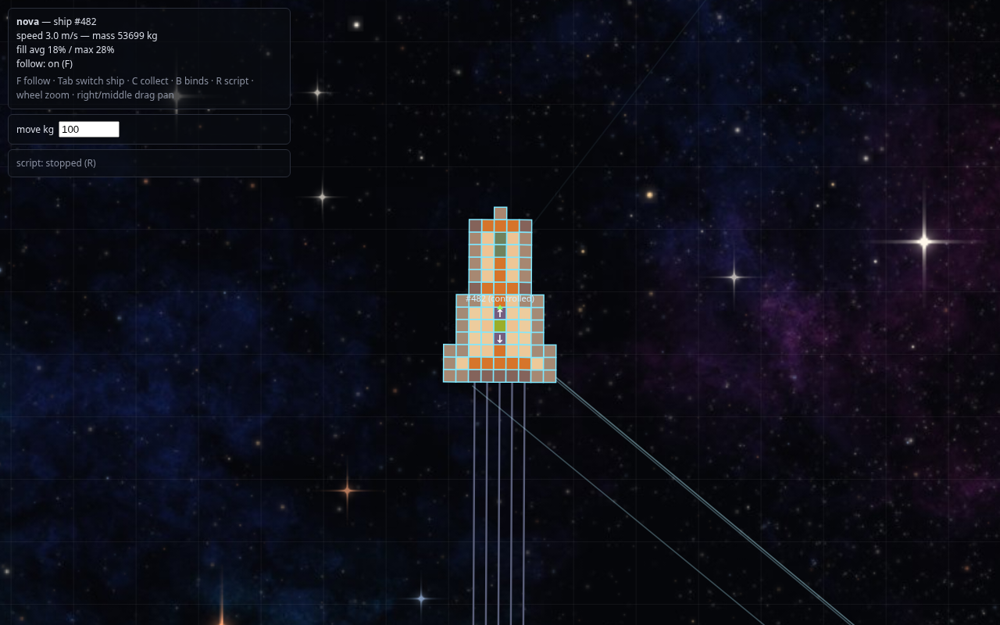

# Space Energy

A 2D multiplayer space game played in the browser. Everything in it is built from blocks, and every block holds **mass** and **energy**. You collect energy, move it around your ship, and shoot it back out: as thrust, as a laser, or as waste heat.

There is no goal yet. Fly around, mine asteroids, grow your ship, and automate it with scripts.



*Where you start. The big discs are suns, the thin lines are sunlight, the small lumps are asteroids, and the marker in the middle is your ship.*

## Getting in

Open the game, type a username and press **Connect**. There are no passwords: the name is your account, and typing the same name later gives you your ships back.



You get a starter ship parked next to a sun.

## Your ship



Each square is one block (1 m × 1 m). Hover a block to see its material, its mass and its energy. The more energy a block holds, the more its colour shifts.

The starter ship, from the nose down:

| Part | Material | What it does |
|---|---|---|
| Laser (nose tip) | iron | Fires energy out of the front |
| Battery | tungsten | Stores a lot of energy without bursting |
| Wiring | copper | Carries energy quickly through the ship |
| Insulation | plastic | Keeps energy from leaking where it should not go |
| Reactor (green, centre) | uranium | Slowly turns its own mass into energy |
| Outlets (arrows) | silicon | One-way valves: reactor to laser, reactor to engines |
| Engines and thrusters | lead | Heavy fuel tanks that throw mass out to push the ship |
| Hull | iron | Everything else |

Energy flows on its own between neighbouring blocks, from the fuller block to the emptier one. Copper moves it fast, plastic barely at all. You steer it by choosing what sits next to what.

### The one rule to remember

**A block that holds more energy than its capacity bursts.** It is destroyed, its energy flies off in all directions, and its mass is thrown out as loose packets. A bursting block can overload its neighbours and start a chain reaction.

That makes bursting both the main danger (your reactor never stops, so the energy has to go somewhere) and the main tool (it is how you mine and how you fight). Keep an eye on `fill avg / max` in the top left. If the maximum climbs towards 100%, dump energy by venting (`X`) or by firing the laser.

## Flying



Thrust comes from throwing mass out of a block. The exhaust goes one way and the ship goes the other. Each burn costs a little lead and a little energy, so your engines are also your fuel tanks.

| Key | Action |
|---|---|
| `W` / `S` | Forward / brake and reverse |
| `A` / `D` | Turn left / right |
| `Q` / `E` | Strafe left / right |
| `Space` | Fire the laser |
| `X` | Vent hull heat into space |
| `1` / `2` | Open / close the reactor outlet to the battery and laser |
| `3` / `4` | Open / close the reactor outlet to the engines |
| `C` | Collect nearby mass packets |
| `F` | Camera follow on / off |
| `Tab` | Switch to your next ship |
| `B` | Key bind editor |
| `R` | Script editor |
| Mouse wheel | Zoom |
| Right or middle drag | Pan the camera |

For now ships brake by themselves when you let go of the keys, so you can fly by hand without drifting away forever.

## Getting energy

- **Sunlight.** Suns shine energy in all directions and any block the light hits absorbs it. Closer means more, and too close means bursting hull.
- **Uranium.** The reactor makes energy all the time by using up its own mass. It cannot be switched off, only closed off with the silicon outlets.

Energy that is emitted into empty space is gone. That is how you cool down.

## Mining and building

Asteroids are mostly rock with small deposits of useful materials inside.

1. Fly close and point your nose at the asteroid. The laser weakens with distance, so a few dozen metres is better than a few hundred.
2. Hold `Space`. The blocks you hit heat up and burst. Rock leaves nothing behind; minerals fly out as mass packets.
3. Press `C` to collect packets within 10 m of your ship. They top up blocks of the same material, and anything that does not fit becomes a new block on your hull.

To rearrange your ship, click one of your blocks to pick it as the source, then click another block of the same material or an empty cell next to the ship. The amount in the `move kg` box moves there, and moving mass into an empty cell creates a new block. Right click or `Esc` cancels the selection. A block that runs out of mass disappears.

## Materials

| Material | Good for |
|---|---|
| iron | Emitting a lot of energy at once: lasers |
| copper | Wiring |
| lead | Holding a lot of mass: engines and storage |
| plastic | Insulation |
| tungsten | Batteries, and armour that is hard to burst |
| uranium | Reactors |
| silicon | Switchable one-way conductor |
| rock | Nothing. Asteroid filler that cannot be collected |

## Key binds

Press `B` to open the bind editor. A bind is a key plus a list of actions, and each action tells one block to emit some energy and/or mass through one of its faces (or in all directions). The default keys above are ordinary binds for the starter ship, so once you rebuild your ship you will want to change them. Use **pick a block** and click the block on your ship.

Emitting at least 1 J from a silicon block also points it in that direction, which opens it. Emitting in all directions closes it again.

## Scripts

Press `R` to open the script editor. Each ship can run one JavaScript program that sends the same commands you could send by hand:

```js
function setup() {
  menu.button("vent selected", () => {
    const b = ship.selectedBlock;
    if (b) ship.emit(b.p, "all", b.energy);
  });
}

function loop() {
  // runs 25 times per second
  if (world.packets.length > 0) ship.collect();
}
```

**load example** gives you a working script with a "stabilize" button and automatic collecting, and the **API** section below the editor lists everything a script can see and do. Scripts run in your browser, so they only run while you are connected.

## Good to know

- Ships do not collide, and there is no death or respawn. If you lose every block of every ship you become a spectator and need a new username to play again.
- When you log off, your ship is taken out of the world and comes back when you return.
- The full rules, with all formulas, are in [design.md](design.md).

## Running it yourself

You need Node.js and Rust.

```sh
cd client && npm ci && npm run build
cd ../server && cargo run --release
```

Then open <http://localhost:8080>. The server listens on `PORT` (default 8080), generates the world from `SEED` (random if unset), and saves player ships to `SAVE_FILE` (default `save.json`) every 3 minutes and on Ctrl-C.

For client development, run `npm run dev` in `client/` next to the server; Vite forwards the websocket to port 8080.

